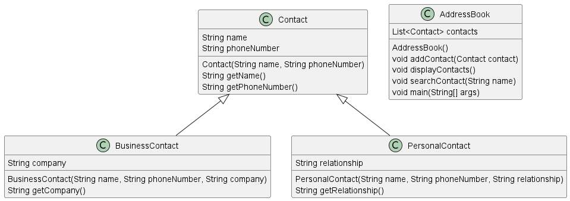

# 자료구조 실습

## 클래스 구조



## 요구 명세

### 프로그램 목표

사용자가 연락처 정보를 추가하고 검색할 수 있는 프로그램을 만들어봅시다.

### 기능 1

#### 메뉴 선택

프로그램을 실행하면 아래의 메뉴 선택 화면이 출력됩니다.

```
1. 비즈니스 연락처 추가
2. 개인 연락처 추가
3. 연락처 출력
4. 연락처 검색
5. 종료
메뉴를 선택해주세요: 
````

사용자는 1번부터 5번까지의 번호 중 하나를 입력할 수 있습니다. 사용자 입력을 받기 위해 `Scanner` 클래스를 이용합니다.

### 기능 2

#### 비즈니스 연락처 추가

사용자가 1번 메뉴를 선택했을 때 아래의 화면이 출력됩니다.

```
이름을 입력하세요: 
전화번호를 입력하세요: 
회사명을 입력하세요: 
```

사용자는 이름, 전화번호, 회사명을 입력할 수 있습니다. 사용자 입력이 완료되면 메뉴 선택 화면으로 돌아갑니다.

##### 예시

```
이름을 입력하세요: 오르미
전화번호를 입력하세요: 010-1234-5678
회사명을 입력하세요: ESTsoft
```

### 기능 3

#### 개인 연락처 추가

사용자가 2번 메뉴를 선택했을 때 아래의 화면이 출력됩니다.

```
이름을 입력하세요: 
전화번호를 입력하세요: 
관계를 입력하세요: 
```

사용자는 이름, 전화번호, 관계를 입력할 수 있습니다. 사용자의 입력이 완료되면 메뉴 선택 화면으로 돌아갑니다.

##### 예시

```
이름을 입력하세요: 오름이
전화번호를 입력하세요: 010-8765-4321
관계를 입력하세요: 친구
```

### 기능 4

#### 연락처 출력

사용자가 3번 메뉴를 선택했을 때 현재까지 추가한 모든 연락처를 출력합니다.

```
이름: 오르미, 전화번호: 010-1234-5678, 회사명: ESTsoft
이름: 오름이, 전화번호: 010-8765-4321, 관계: 친구
```

비즈니스 연락처는 이름, 전화번호, 회사명을 출력합니다.

개인 연락처는 이름, 전화번호, 관계를 출력합니다.

단, 연락처 정보가 없는 경우 아래와 같은 화면을 출력합니다.

```
연락처가 비어있습니다.
```

연락처 출력이 완료되면 메뉴 선택 화면으로 돌아갑니다.

### 기능 5

#### 연락처 검색

사용자가 4번 메뉴를 선택했을 때 이름을 입력할 수 있고, 연락처에 해당 이름이 있을 경우 출력합니다.

```
검색할 이름을 입력하세요: 
```

이름이 일치하는 연락처가 있을 경우 화면에 출력합니다. 동일한 이름의 연락처가 여러 개 있다면 모두 출력합니다.

```
검색할 이름을 입력하세요: 오르미
이름: 오르미, 전화번호: 010-1234-5678, 회사명: ESTsoft
```

```
검색할 이름을 입력하세요: 오름이
이름: 오르미, 전화번호: 010-8765-4321, 관계: 친구
```

비즈니스 연락처는 이름, 전화번호, 회사명을 출력합니다.

개인 연락처는 이름, 전화번호, 관계를 출력합니다.

만약, 일치하는 이름의 연락처가 없다면 아래의 화면을 출럭합니다.

```
연락처를 찾을 수 없습니다.
```

연락처 검색이 완료되면 메뉴 선택 화면으로 돌아갑니다.

### 기능 6

#### 종료

사용자가 5번 메뉴를 선택했을 때 프로그램을 종료합니다.