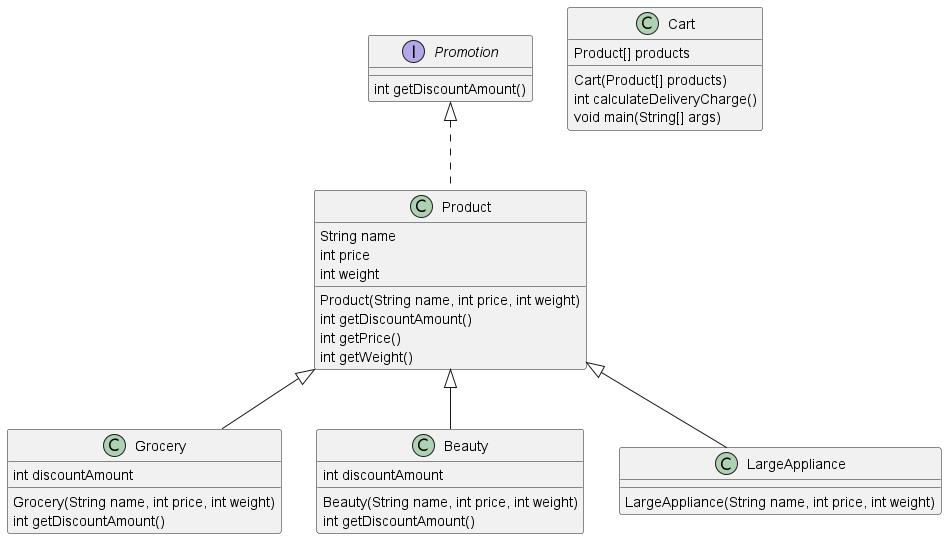

# Products and Promotion

## 클래스 및 인터페이스 구조

|              클래스 및 인터페이스              |                        개요                        |
|:-------------------------------------:|:------------------------------------------------:|
|                Product                |                   상품 (부모 클래스)                    |
| Grocery Beauty LargeAppliance |                 세부 상품들 (자식 클래스)                  |
|                 Cart                  |       장바구니 해당 문제에서는 배송비를 계산하는 메소드만 구현        |
|               Promotion               | 쇼핑몰 이벤트 (인터페이스) 해당 문제에서는 할인 금액을 반환하는 메소드만 구현 |

## 요구 명세

쇼핑몰에서 판매하는 상품 종류는 아래 3가지 입니다.
- 식료품 (Grocery)
- 화장품 (Beauty)
- 대형가전 (LargeAppliance)

각 상품들은 서로 다른 `무게`, `가격`, `할인금액` 속성을 가집니다.

|       상품       | 무게 |   가격   |  할인금액  |
|:--------------:|:--:|:------:|:------:|
|    Grocery     | 3  | 20,000 |  2000  |
|     Beauty     | 2  | 30,000 | 10,000 |
| LargeAppliance | 5  | 50,000 |   0    |

배송비는 3가지 상품의 무게의 **총합**, 가격의 **총합**으로 계산합니다.

무게에 따라 배송비가 책정됩니다.

|     무게     |  배송비   |
|:----------:|:------:|
|    3 미만    |  1000  |
| 3 이상 10 미만 |  5000  |
|   10 이상    | 10,000 |

무게로 책정된 배송비는 아래와 같이 상품 가격에 따라 추가 할인이 됩니다. **여기서의 가격은 할인금액이 적용된 가격**입니다.

|          가격          |     배송비     |
|:--------------------:|:-----------:|
|      30,000 미만       |  배송비 변동 없음  |
| 30,000 이상 100,000 미만 | 배송비 1000 할인 |
|      100,000 이상      |   배송비 무로    |